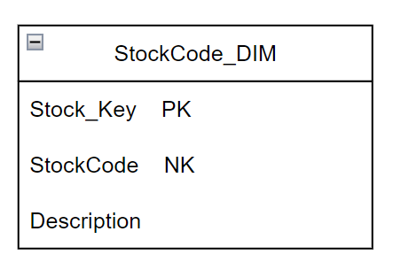
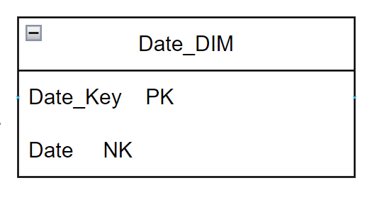
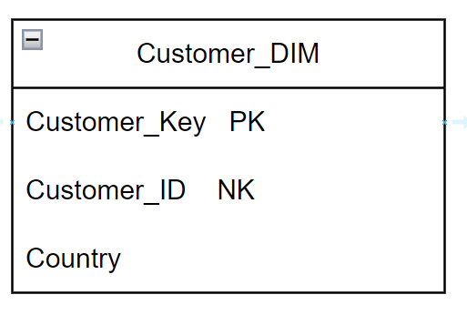
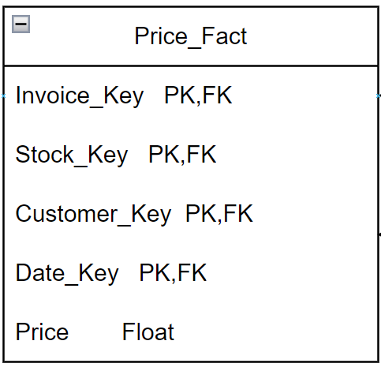
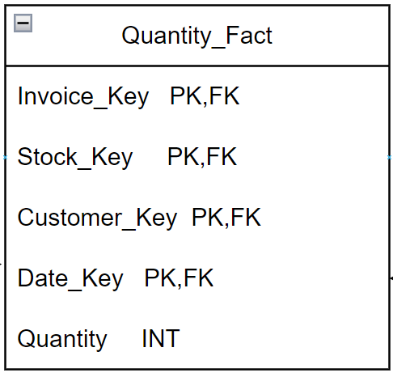
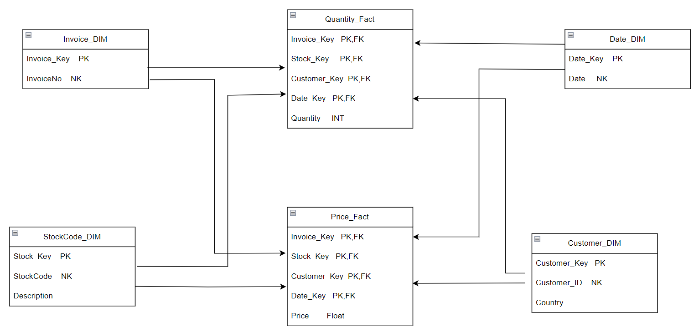

<h2>From CSV to Data Warehouse: Modeling E-commerce Data for Analysis </h2>

<h3> Goal Of The Project:</h3>
Empower Data-Driven Decisions: Create a Star Schema Data Warehouse to Store and Analyze E-commerce Data, Driving Strategic Business Decisions.

<h3>Table of Contents:</h3>
<ol>
    <li> <a href="#data">About the data  </a></li>
    <li><a href="#architecture"> The Architecture  </a></li>
    <li> <a href="#steps">Steps implemented </a></li>
    <li> <a href="#analysis">Analysis </a> </li>
</ol>

<h4 id="data"> <b> 1. About the data </b></h4>
The data was used from the <a href="https://www.kaggle.com/datasets/carrie1/ecommerce-data"> Kaggle </a>. 
It is the dataset about an E-commerce site, which has 8 columns in total.
The columns are:
<ol>
    <li>InvoiceNo</li>
    <li>StockCode</li>
    <li>Description</li>
    <li>Quantity</li>
    <li>InvoiceDate</li>
    <li>UnitPrice</li>
    <li>CustomerID</li>
     <li>Country</li>
</ol>

<h4 id="architecture"> <b> 2. The Architecture </b></h4>

This dimensional model consists of 4 dimension tables and 2 fact tables.
The dimension table are presented as TableName_DIM with a suffix DIM and for fact table, Fact as the suffix, TableName_Fact.
<ol type="i">
    <li>Invoice_DIM:</li>  
      </img>
      
     Here, Invoice_key is the primary key,for primary key, I have used the surrogate key which is an auto-increment, set during this table was built.
     Where as, InvoiceNo is the Natural Key.
     
     
     <li> StockCode_DIM:</li>
      
      </img> 
      
     Here, there are three columns in total, Stock_key is the primary key which is the surrogate key (set as auto-increment). StockCode is the Natural key and description is the column that holds the information about the product.
     
     
    <li> Date_DIM: </li>
     
     </img>  
     
    It contains two columns, Date_Key is the primary key (surrogate key set to an auto-increment) and Date which hold the date information when certain event or transaction took place.
     
     
    <li > Customer_DIM: </li>
     
     </img>
     
    This dimensional table contains Customer_Key as the primary key(surrogate key set to an auto-increment), Customer_ID as the Natural Key and country of the customer.
     
     
    <li> Price_Fact:</li>
     
     </img>
      
     
Here, this fact table contains 5 columns in total, the primary keys are all the foreign keys that are used in this table, suffixed by _Key. They are representd as PK,FK.  All these foreign keys are the primary keys of the other 4 dimensional tables and a column Price that holds our facts/measurements/metrics.
      
      
     <li> Quantity_Fact: </li>
      
      </img>
     
    
This fact table consists of 5 columns, the first 4 columns are the primary key of this table, which are the foreign keys of the other 4 dimensional tables, represented as PK,FK.
    And there is the quantity column, which will hold the facts/metrics/measurement.
</ol>
 

 <b>
  The Final Dimensional Architecture. </b>
  
 </img>

 <h3>REASON OF CREATING TWO FACT TABLES INSTEAD OF ONE: </H3>
In order for two or more facts to go into the same table,it must fulfill two conditions:
<ol>
    <li>Both of the facts should have the same level of granularity.</li>
    <li> Both of the facts must occur simultaneously </li>
</ol>

 Since they don't satisfy these conditions as well as belong to different facts, I have kept them in a separate fact table.

 
<h4 id="steps"> <b>3. Steps Implemented: </b></h4>
So, first I read the data frame in Pandas, since SQL was not able to handle the NAN values, I replaced it with NA. The reason of not dropping the NAN values is, I am depicting a Data Warehouse, and in Data warehouse, we keep the data as it is obtained from the source else the major funcionality of the Data warehouse i.e. one stop shop for the historical data won't make sense.
 
Then I extracted the required fields as per the dimension in different dataframe and first inserted the data into all the dimensional tables and at last inserted the data into the fact tables.
 
 
<h4 id="analysis"> <b> 4. Analysis:</b> </h4>

 TO BE CONTINUED 
