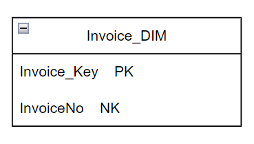

<h2>From CSV to Data Warehouse: Modeling E-commerce Data for Analysis </h2>

<h3> Goal Of The Project:</h3>
Empower Data-Driven Decisions: Create a Star Schema Data Warehouse to Store and Analyze E-commerce Data, Driving Strategic Business Decisions.

<h3>Table of Contents:</h3>
<ol>
    <li> <a href="#data">About the data  </a></li>
    <li><a href="#architecture"> The Architecture  </a></li>
    <li> <a href="#steps">Steps implemented </a></li>
    <li> <a href="#analysis">Analysis </a> </li>
</ol>

<h4 id="data">1. About the data </h4>
The data was used from the <a href="https://www.kaggle.com/datasets/carrie1/ecommerce-data"> Kaggle </a>. 
It is the dataset about an E-commerce site, which has 8 columns in total.
The columns are:
<ol>
    <li>InvoiceNo</li>
    <li>StockCode</li>
    <li>Description</li>
    <li>Quantity</li>
    <li>InvoiceDate</li>
    <li>UnitPrice</li>
    <li>CustomerID</li>
     <li>Country</li>
</ol>

<h4 id="#architecture">2. The Architecture </h4>

This dimensional model consists of 4 dimension tables and 2 fact tables.
The dimension table are presented as TableName_DIM with a suffix DIM and for fact table, Fact as the suffix, TableName_Fact.
<ol type="i">
    <li>Invoice_DIM:</li>
      </img>
      
     Here, Invoice_key is the primary key,for primary key, I have used the surrogate key which is an auto-increment, set during this table was built.
     Where as, InvoiceNo is the Natural Key.
</ol>
 
